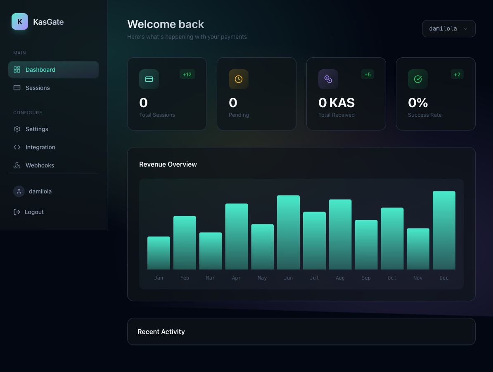
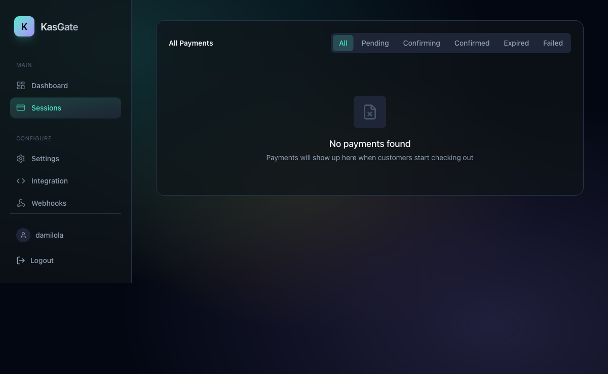
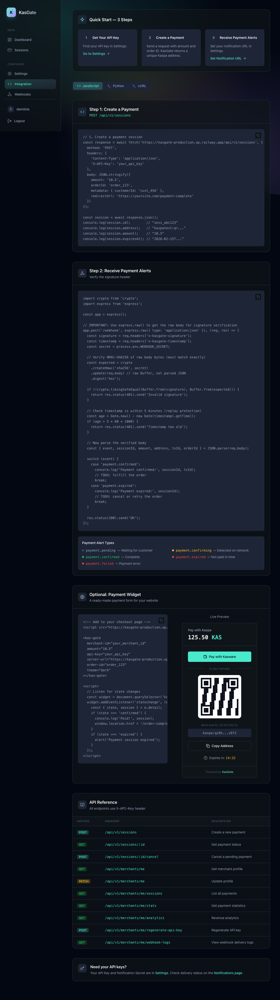

# KasGate — Universal Kaspa Payment Gateway

Accept Kaspa cryptocurrency payments on any website with a single API call.

[](https://github.com/dmustapha/kasgate/actions/workflows/ci.yml)
[](https://github.com/dmustapha/kasgate/actions)
[](https://www.typescriptlang.org/)
[](LICENSE)



## Live Demo

**[kasgate-production.up.railway.app/dashboard](https://kasgate-production.up.railway.app/dashboard)**

Create a free account to explore the full dashboard.

## Demo Video

[](https://youtu.be/vmAQz18icq4?si=dvoD1WaTgFEod8jf)

---

## What Is KasGate?

KasGate is the Stripe of Kaspa. Register as a merchant, get an API key, and start accepting KAS payments in minutes.

- Create a payment session with one POST request
- KasGate generates a unique Kaspa address per payment
- Your webhook fires when the blockchain confirms the transaction
- Track everything from the dashboard in real time

---

## Screenshots

| Dashboard | Sessions | Integration |
|-----------|----------|-------------|
|  |  |  |

---

## Features

- **Simple API**: Create payments with a single `POST` request
- **Real-time updates**: WebSocket-powered payment notifications
- **Non-custodial**: Merchants control their own keys via xPub HD wallet
- **Webhook system**: HMAC-signed server-to-server notifications
- **Drop-in widget**: Embed a payment form in 3 lines of HTML
- **Kasware support**: One-click payments with browser wallet
- **Multi-network**: Single env var switches testnet to mainnet
- **71 tests**: Unit and integration tests across all critical paths

---

## Tech Stack

| Layer | Technology |
|-------|-----------|
| Runtime | Bun |
| Backend | TypeScript, Express |
| Frontend | Next.js 14, Tailwind CSS, shadcn/ui |
| Database | SQLite via better-sqlite3 |
| Blockchain | Kaspa RPC (testnet-10 / mainnet) |
| Testing | Vitest |
| Deployment | Railway |

---

## Quick Start

### 1. Register as a merchant

Visit the [dashboard](https://kasgate-production.up.railway.app/dashboard/register) and create an account with your Kaspa xPub key.

To get your xPub key, use either:
- **[Kaspa-NG](https://kaspa-ng.org)** — desktop/web wallet, find xPub under wallet settings
- **[KasWare](https://kasware.xyz)** — browser extension wallet, export xPub from account details

### 2. Create a payment

```javascript
const response = await fetch('https://kasgate-production.up.railway.app/api/v1/sessions', {
  method: 'POST',
  headers: {
    'Content-Type': 'application/json',
    'X-API-Key': 'your_api_key'
  },
  body: JSON.stringify({
    amount: '10.5',
    orderId: 'order_123'
  })
});

const session = await response.json();
console.log(session.address); // kaspa:qr... — send payment here
console.log(session.id);      // sess_abc123 — track status
```

### 3. Receive payment confirmation

```javascript
app.post('/webhook', express.raw({ type: 'application/json' }), (req, res) => {
  const signature = req.headers['x-kasgate-signature'];
  const expected = crypto.createHmac('sha256', process.env.WEBHOOK_SECRET)
    .update(req.body).digest('hex');

  if (!crypto.timingSafeEqual(Buffer.from(signature), Buffer.from(expected))) {
    return res.status(401).send('Invalid signature');
  }

  const { event, sessionId, txId } = JSON.parse(req.body);

  if (event === 'payment.confirmed') {
    console.log('Payment confirmed:', txId);
  }

  res.status(200).send('OK');
});
```

### Optional: Drop-in Widget

```html
<script src="https://kasgate-production.up.railway.app/widget/kasgate.js"></script>
<kas-gate
  api-key="your_api_key"
  amount="10.5"
  order-id="order_123"
  theme="dark"
></kas-gate>
```

---

## API Reference

All endpoints require `X-API-Key` header.

| Method | Endpoint | Description |
|--------|----------|-------------|
| `POST` | `/api/v1/sessions` | Create a payment session |
| `GET` | `/api/v1/sessions/:id` | Get payment status |
| `POST` | `/api/v1/sessions/:id/cancel` | Cancel a pending payment |
| `GET` | `/api/v1/merchants/me` | Get merchant profile |
| `GET` | `/api/v1/merchants/me/sessions` | List all payments |
| `GET` | `/api/v1/merchants/me/stats` | Payment statistics |
| `GET` | `/api/v1/merchants/me/analytics` | Revenue analytics |
| `GET` | `/api/v1/merchants/me/webhook-logs` | Webhook delivery logs |

---

## Running Locally

```bash
git clone https://github.com/dmustapha/kasgate.git
cd kasgate
bun install
cp .env.example .env
bun run dev
```

Visit `http://localhost:3000/dashboard`

```bash
# Run tests
bun test
```

---

## Architecture

```
┌─────────────────┐     POST /api/v1/sessions      ┌──────────────────┐
│   Your Website  │ ──────────────────────────────> │  KasGate Server  │
│  (any frontend) │ <── { address, sessionId } ──── │  (Express + Bun) │
└─────────────────┘                                 └────────┬─────────┘
                                                             │
                          ┌──────────────────────────────────┤
                          │                                  │
                   ┌──────▼──────┐                   ┌───────▼───────┐
                   │  Kaspa RPC  │                   │   SQLite DB   │
                   │  (Testnet / │                   │  (Payments,   │
                   │   Mainnet)  │                   │   Merchants)  │
                   └──────┬──────┘                   └───────────────┘
                          │
              Payment confirmed on-chain
                          │
                   ┌──────▼──────┐
                   │   Webhook   │
                   │  (HMAC sig) │ ──> Your server notified
                   └─────────────┘
```

---

## License

MIT
